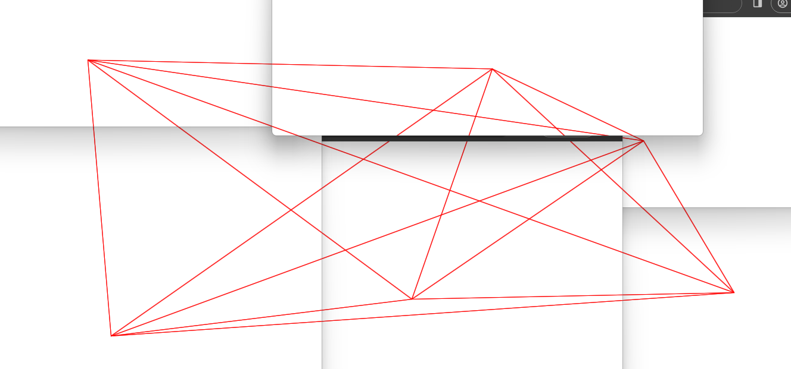

# Multi-screen canvas
A demonstration of using multiple browser windows, and passing information through local storage.

I saw a video on TikTok, and wanted to see if I could re-create the effect of joining multiple windows and connecting lines.

<!-- image of demo -->

Will probably try to integrate Three.JS for 3D graphics in the future to make it more interesting.

## Demo

A live demonstration can be found on GitHub pages, [here](https://jxl-s.github.io/multi-window-canvas/).